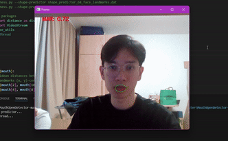

# Mouth Open Detector (MOD)
## Introduction
This repository contains the code for the research article **"[Mouth Detector with Combination Between LipNet and PyImageSearch](https://wjarr.com/content/mouth-detector-combination-between-lipnet-and-pyimagesearch)"**, published in the World Journal of Advanced Research and Reviews (WJARR), Volume 22, Issue 3, 2024. The study explores the innovative integration of LipNet and PyImageSearch to develop a robust mouth detection system using deep learning and computer vision, aimed at enhancing the accuracy and reliability of automatic lip reading technology.

## Tools and Libraries

- python
- scipy
- imutils
- numpy
- dlib
- cv2

## Usage
This sample version uses your webcam, so ensure the device you are using has one. If your device lacks a webcam, you will need to modify the code to take input from a video file.

To run the mouth open detector, use the following commands:
```sh
python detect_open_mouth.py
```

## Installation
Ensure you have the necessary packages installed. You can install them using pip:

```sh
pip install scipy imutils numpy dlib opencv-python
```

## Code Explanation

### Import the necessary packages

```python
from scipy.spatial import distance as dist
from imutils.video import VideoStream
from imutils import face_utils
from threading import Thread
import numpy as np
import argparse
import imutils
import time
import dlib
import cv2
```

### Define the Mouth Aspect Ratio function

```python
def mouth_aspect_ratio(mouth):
    A = dist.euclidean(mouth[2], mouth[10]) # 51, 59
    B = dist.euclidean(mouth[4], mouth[8])  # 53, 57
    C = dist.euclidean(mouth[0], mouth[6])  # 49, 55
    mar = (A + B) / (2.0 * C)
    return mar
```

### Construct the argument parse and parse the arguments

```python
ap = argparse.ArgumentParser()
ap.add_argument("-p", "--shape-predictor", required=False, default='shape_predictor_68_face_landmarks.dat',
    help="path to facial landmark predictor")
ap.add_argument("-w", "--webcam", type=int, default=0,
    help="index of webcam on system")
args = vars(ap.parse_args())
```

### Define constants and initialize dlib's face detector and facial landmark predictor

```python
MOUTH_AR_THRESH = 0.79

print("[INFO] loading facial landmark predictor...")
detector = dlib.get_frontal_face_detector()
predictor = dlib.shape_predictor(args["shape_predictor"])

(mStart, mEnd) = (49, 68)
```

### Start the video stream thread

```python
print("[INFO] starting video stream thread...")
vs = VideoStream(src=args["webcam"]).start()
time.sleep(1.0)

frame_width = 640
frame_height = 360
out = cv2.VideoWriter('outpy.avi',cv2.VideoWriter_fourcc('M','J','P','G'), 30, (frame_width,frame_height))
time.sleep(1.0)
```

### Main loop

```python
while True:
    frame = vs.read()
    frame = imutils.resize(frame, width=640)
    gray = cv2.cvtColor(frame, cv2.COLOR_BGR2GRAY)
    rects = detector(gray, 0)

    for rect in rects:
        shape = predictor(gray, rect)
        shape = face_utils.shape_to_np(shape)
        mouth = shape[mStart:mEnd]
        mouthMAR = mouth_aspect_ratio(mouth)
        mar = mouthMAR
        mouthHull = cv2.convexHull(mouth)
        cv2.drawContours(frame, [mouthHull], -1, (0, 255, 0), 1)
        cv2.putText(frame, "MAR: {:.2f}".format(mar), (30, 30), cv2.FONT_HERSHEY_SIMPLEX, 0.7, (0, 0, 255), 2)
        if mar > MOUTH_AR_THRESH:
            cv2.putText(frame, "Mouth is Open!", (30,60), cv2.FONT_HERSHEY_SIMPLEX, 0.7, (0,0,255),2)

    out.write(frame)
    cv2.imshow("Frame", frame)
    key = cv2.waitKey(1) & 0xFF
    if key == ord("q"):
        break

cv2.destroyAllWindows()
vs.stop()
```

## Demo


## Citation
If you use this code in your research, please cite our paper:

Le Minh Quan Tran, Linh Nguyen Anh Hoang, "Mouth Detector with Combination Between LipNet and PyImageSearch", World Journal of Advanced Research and Reviews, Volume 22, Issue 3, 2024.

## Acknowledgements
Special thanks to my mentor and co-author, Linh Nguyen Anh Hoang, for their guidance and support throughout this project.
